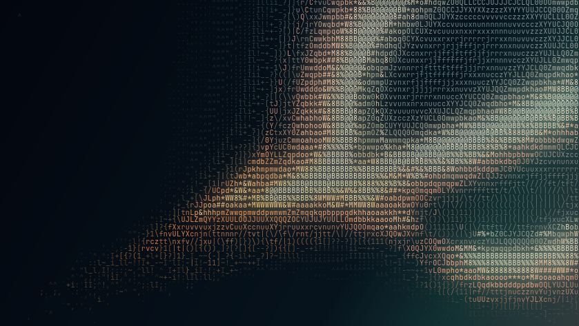
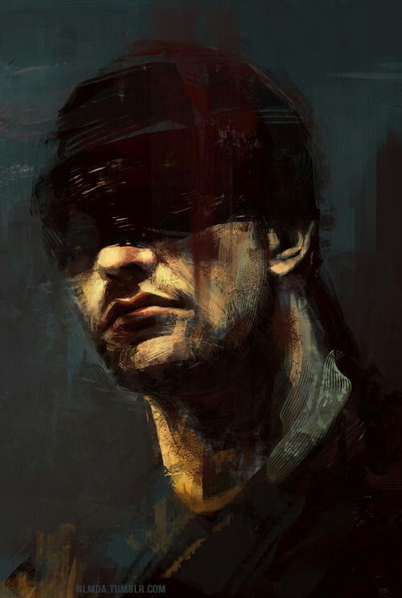
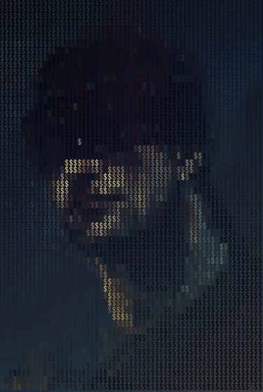
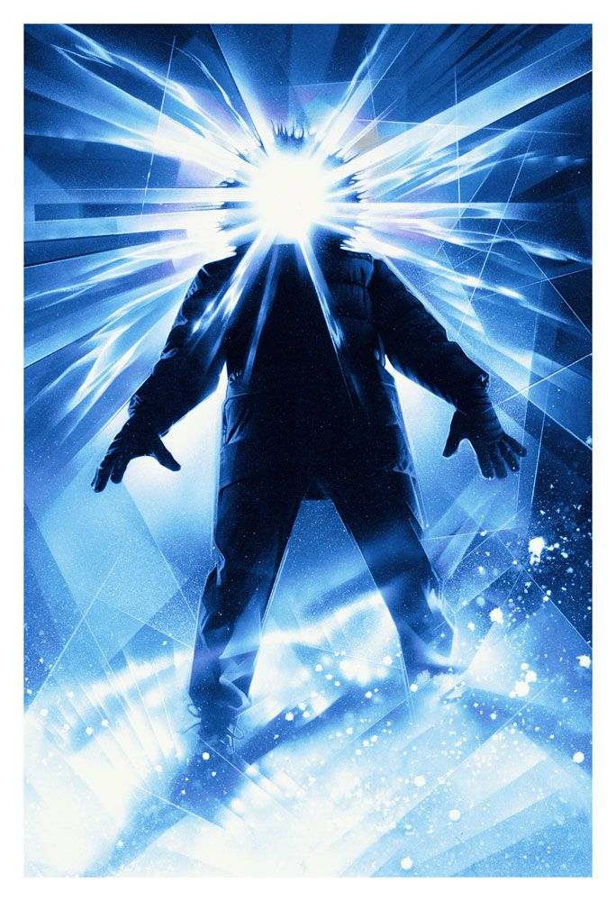
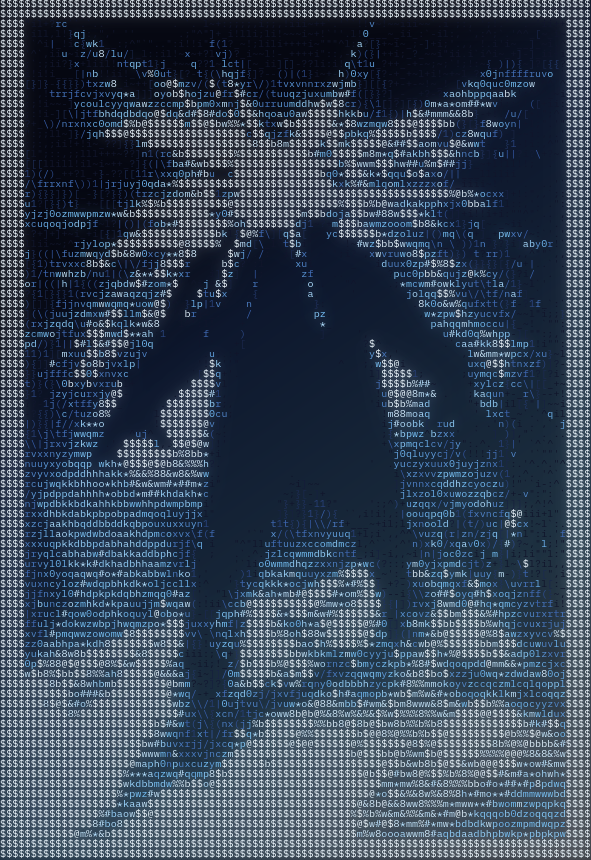

# ascii

a premium, client-side ascii art studio for images and browser-native video. everything is processed locally in the browser at [ascii.ai9an.com](https://ascii.ai9an.com/).

## features

- live image and video-to-ascii rendering
- custom character ramps, palettes, bloom, adjustments, and dithering
- local browser presets
- source, render, and comparison views
- txt, png, clipboard, and supported webm exports
- no backend, accounts, uploads, or build step

## previews

<table>
  <tr>
    <th>source</th>
    <th>ascii</th>
  </tr>
  <tr>
    <td></td>
    <td></td>
  </tr>
  <tr>
    <td></td>
    <td></td>
  </tr>
  <tr>
    <td></td>
    <td></td>
  </tr>
  <tr>
    <td></td>
    <td></td>
  </tr>
</table>

## run locally

```bash
python3 -m http.server 8000
```

open `http://localhost:8000`. modern chromium, firefox, and safari are supported; webm recording availability depends on the browser and codec support.
